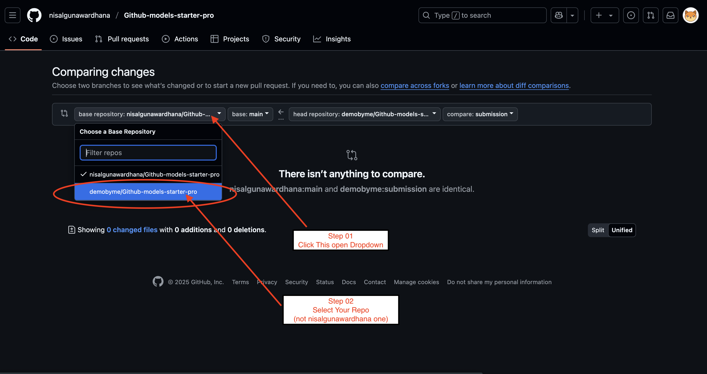
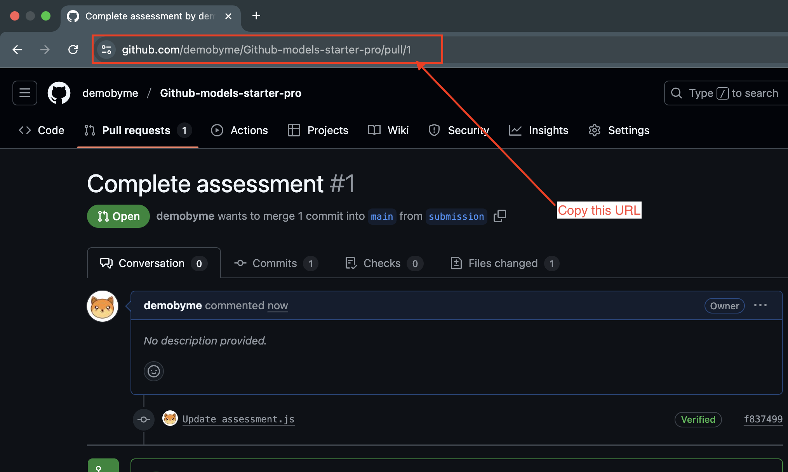

# ACP Starter: Learning the Agent Communication Protocol

Welcome to the ACP Starter repository! This project helps you learn the basics of the Agent Communication Protocol (ACP) by completing a small hands-on task.

## About ACP

The Agent Communication Protocol (ACP) is a standardized way for agents to communicate with clients. It enables building consistent, interoperable agent systems with a clear separation between agents and clients.

## Learn More

To dive deeper into ACP concepts, visit the [Agent Communication Protocol main repository](https://github.com/nisalgunawardhana/Agent-Communication-Protocol) for documentation, examples, and advanced usage.

## Official Documentation

For comprehensive guides and reference material, visit the [ACP Official Documentation](https://agentcommunicationprotocol.dev/introduction/welcome).
## Getting Started

### Prerequisites

- Python 3.11 or higher
- Basic knowledge of Python and async programming
- Git for version control

### Task Overview

In this repository, you'll find a basic ACP agent that echoes messages. Your task is to enhance this agent by adding a simple capability: **making the agent respond with the reversed text of any message it receives**.

## How to Complete the Task

### Step 1: Fork this Repository

Click the "Fork" button at the top right of this repository page to create your own copy.

### Step 2: Clone Your Fork

```bash
git clone https://github.com/nisalgunawardhana/acp-starter
cd acp-starter
```

### Step 3: Create a Submission Branch

```bash
git checkout -b submission
```

### Step 4: Set Up the Environment

```bash
uv init --python '>=3.11' .
uv add acp-sdk
```

### Step 5: Complete the Task

Modify the `agent.py` file to add a "reverse echo" capability. The agent should:
1. Receive a text message
2. Create a reversed version of that message
3. Return both the original and reversed message

### Step 6: Test Your Solution

Run your agent:
```bash
uv run agent.py
```

In another terminal, test it with:
```bash
curl -X POST http://localhost:8000/runs \
  -H "Content-Type: application/json" \
  -d '{
        "agent_name": "echo",
        "input": [
          {
            "role": "user",
            "parts": [
              {
                "content": "Hello ACP!",
                "content_type": "text/plain"
              }
            ]
          }
        ]
      }'
```

Or use the provided client:
```bash
uv run client.py
```

### Step 7: Push Your Changes

```bash
git add .
git commit -m "Add reverse echo functionality"
git push origin submission
```

### Step 8: Create a Pull Request

- Create a pull request from your `submission` branch to the `main` branch on the Your repository.

   
   

    Follow the above images for a visual guide on creating a pull request.

   **Tip:** After creating your pull request, copy the PR link from your browser's address bar. You will need this link when creating your submission issue in the next step.

   

> **Note:** The images above demonstrate how to select the correct branches and create a pull request. The repository name shown in the screenshots may differ from yours—just follow the same steps for your own repository.

### Step 9: Create a Submission Issue

1. Go to the ["Issues" tab](https://github.com/nisalgunawardhana/acp-starter/issues) in the main repository
2. Click "New issue"
3. Use the "Submission" template (if available) or create a new issue with:
   - Title: "Submission: Reverse Echo Agent"
   - Description: Briefly explain your approach and what you learned

## Project Structure

- `agent.py` - The main agent implementation file you need to modify
- `client.py` - A simple client to test your agent
- `README.md` - This guidance file

## 💬 Join the Discussion!

Have questions, ideas, or want to share your experience?  
We welcome you to use [GitHub Discussions](https://github.com/nisalgunawardhana/acp-starter/discussions) for:

- Asking questions about setup or usage
- Sharing feedback or suggestions
- Requesting new features
- Connecting with other contributors

👉 **Click the "Discussions" tab at the top of this repo to start or join a conversation!**

Let's build and learn together!

---

## Connect with Me

Follow me on social media for more sessions, tech tips, and giveaways:

- [LinkedIn](https://www.linkedin.com/in/nisalgunawardhana/) — Professional updates and networking
- [Twitter (X)](https://x.com/thenisals) — Insights and announcements
- [Instagram](https://www.instagram.com/thenisals) — Behind-the-scenes and daily tips
- [GitHub](https://github.com/nisalgunawardhana) — Repositories and project updates
- [YouTube](https://www.youtube.com/channel/UCNP5-zR4mN6zkiJ9pVCM-1w) — Video tutorials and sessions

Feel free to connect and stay updated!

---

## License

This project is open source and available under the [MIT License](LICENSE).

Created by Nisal Gunawardhana.
